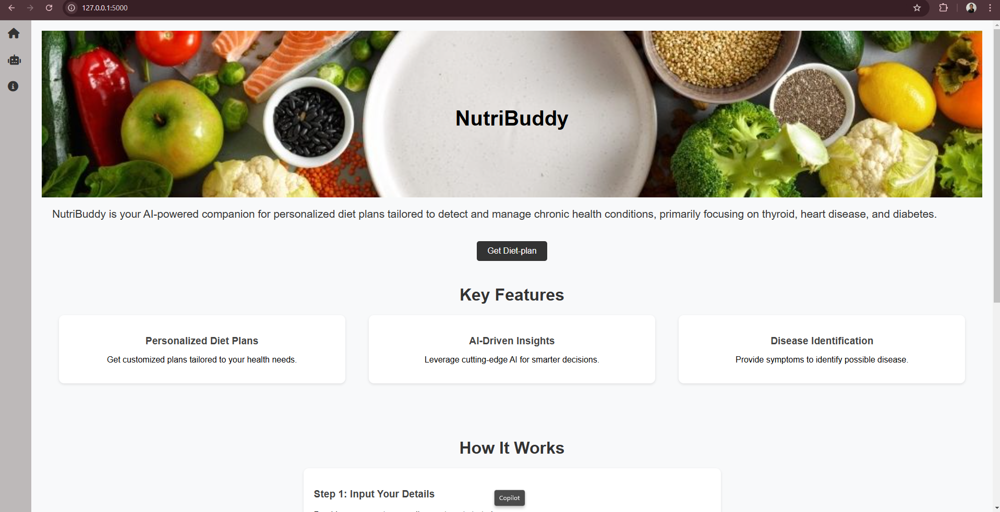
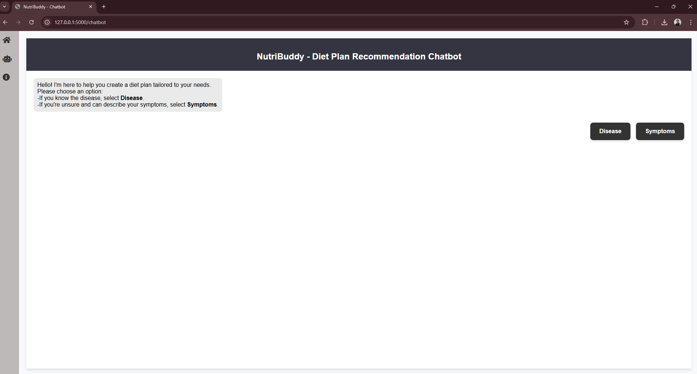
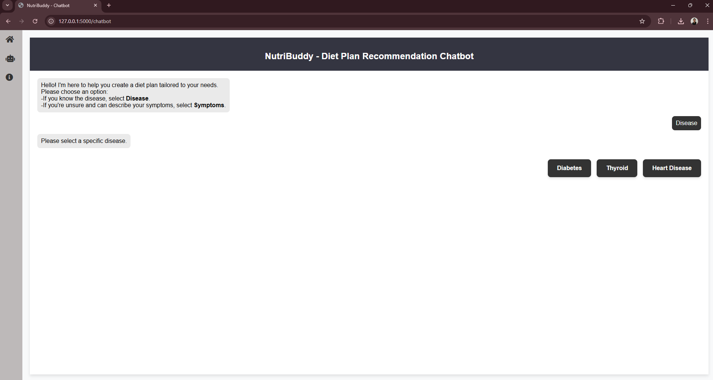
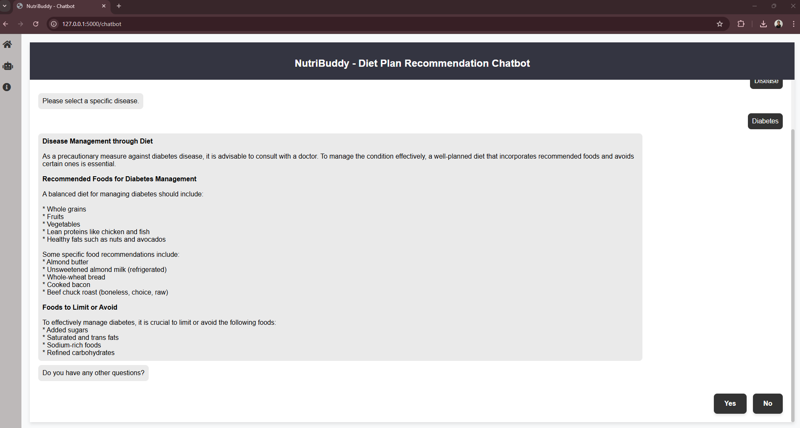
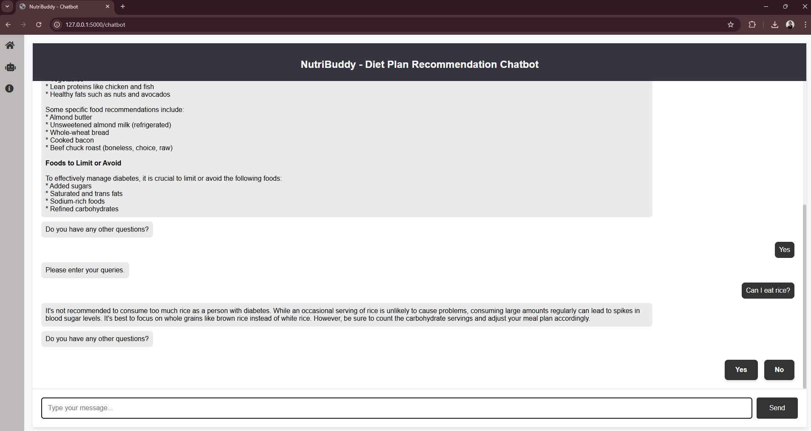
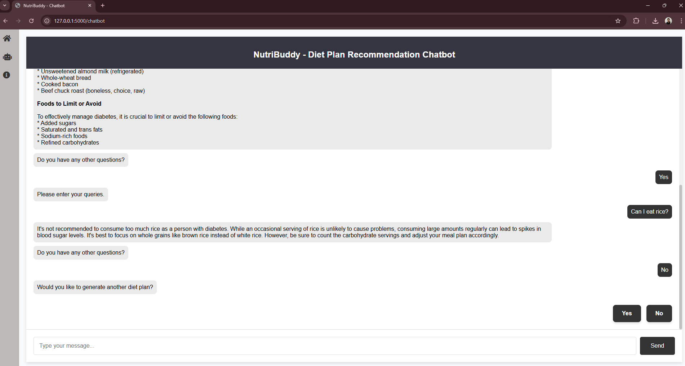
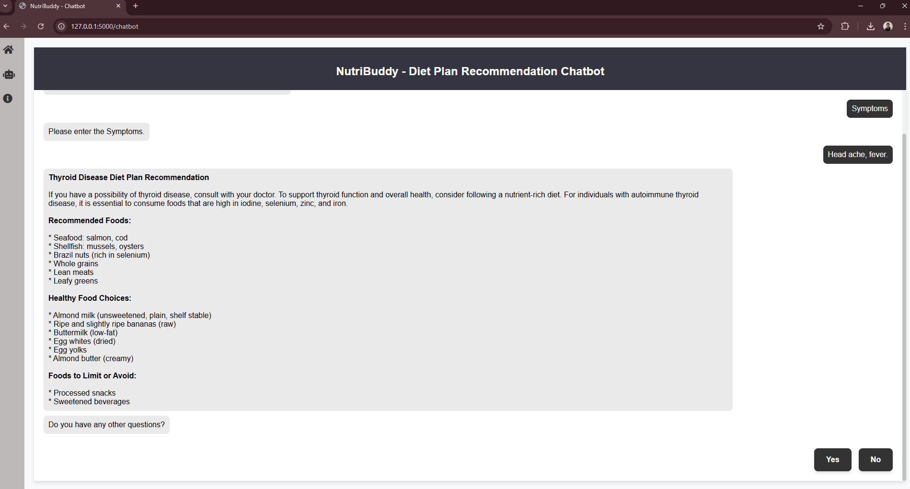
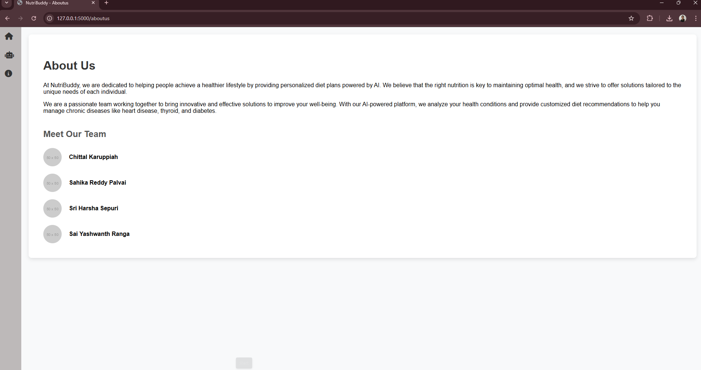

# Diet Plan Recommendation For Chronic Health Conditions using LLM and RAG
This project is an AI based chatbot for diet plan recommendation created to detect and manage chronic health conditions mainly focusing on Thyroid, Diabetes and Heart disease. This Flask application has three pages Home, Chatbot and About us page.
## System Overview
### Home page

### Chatbot page 

### Chatbot page (Disease selection)

### Chatbot page (Disease plan)

### Chatbot page (Disease follow up)

### Chatbot page (Disease another plan follow up)

### Chatbot page (Symptoms plan)

### About us

## Input
The input is symptom or disease. Predict the chronic health conditions if any based on symptoms/disease provided and suggest diet plans for user. 
## Dataset
The dataset for this project are research papers available in Google Scholar and PubMed. We collected research papers on diet plan recommendation and disease prediction from these websites. We also collected foundation food data from USDA Food data central site. This project repository contains sample data folder with foundation food data and research papers. Follow the same folder structure (data/) when adding more data.
## Implementation
We have create a Flask app. This project is implemented using open source LLM and RAG. We have used LLAMA 3.1 8b model to generate responses. When user sends a query, internally we query the vector database to predict disease and generate diet plans using diet plan vector db as retriever and LLAMA LLM.

## Steps to run this project in Windows
Follow the below steps to run this project. 
1. Install Python 3.11, Ollama, and Postgres SQL.
2. Open terminal and execute command to download ollama 3.1 8b.
```
ollama run llama3.1:8b
```
3. Open terminal inside project folder. Create virtual environment using below command.
```
python -m venv venv
```
4. Activate virtual environment once it is created.
```
venv\Scripts\activate
```
5. Install all the requirements using below command.
```
pip install -r requirements.txt
```
6. Create database with name 'food_data' in postgres. 
7. Create .env file with below values inside the main repository.
```
SECRET_KEY
POSTGRES_USERNAME
POSTGRES_PASSWORD
POSTGRES_HOST
POSTGRES_PORT
POSTGRES_DATABASE=food_data
```
8. Run the below command to populate foundation food data to database.
```
python populate_postgres.py
```
9. Create vector database with two collections for disease and diet_plan using below command. It will create vector DB collections in storage/ folder.
```
python vectordb_code/vectorstore.py
```
10. Now, start the flask application using below command.
```
python app.py
```
The application will run in http://127.0.0.1:5000/ URL.
